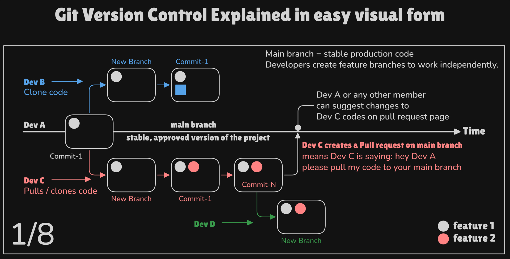
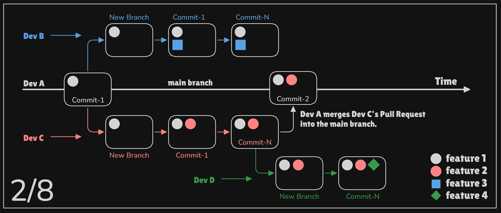
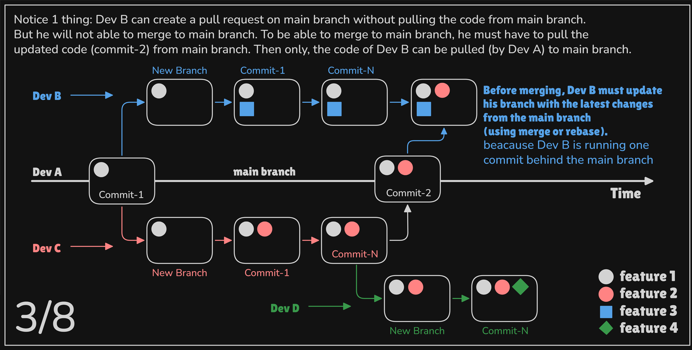
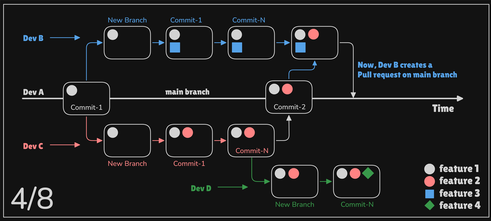
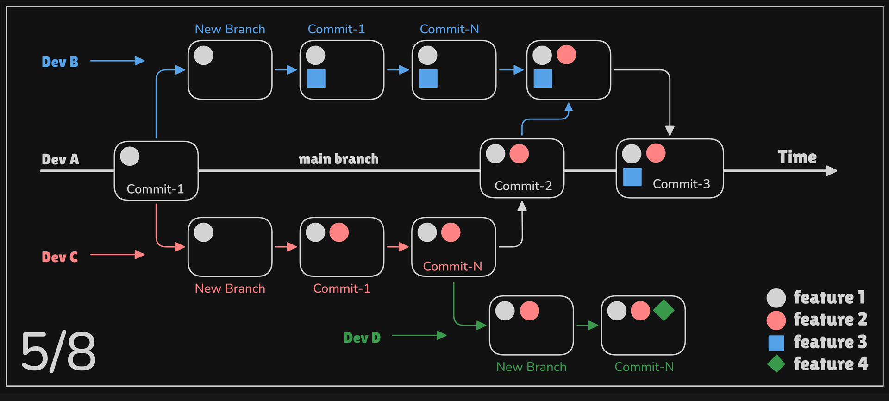
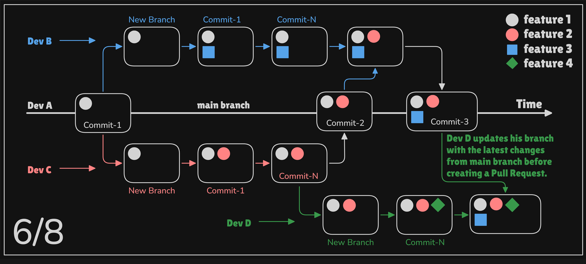
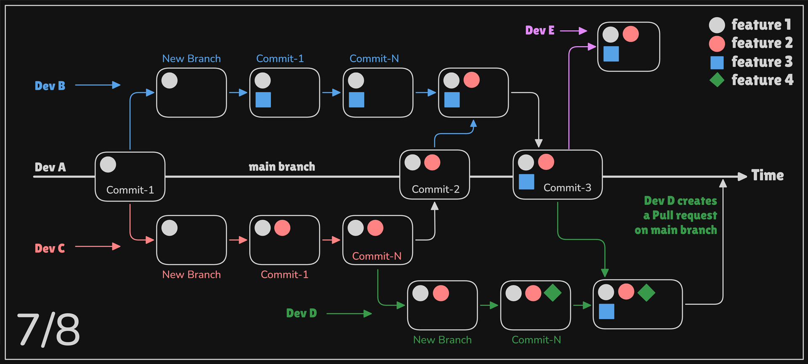
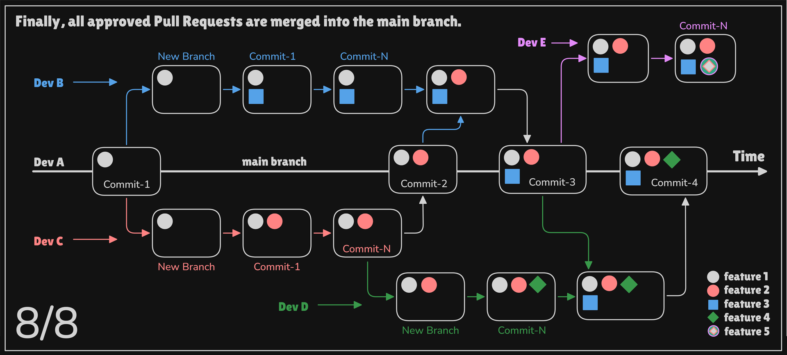

# Git Explained Visually

# Git Workflow Simulation (Real-world Collaboration)

This repository demonstrates how Git works in a real team environment using visual examples.

## 🎯 What this project shows

- How multiple developers work on the same codebase
- Feature branching strategy
- Pull request workflow
- Code review and merge process
- Keeping branches up-to-date with main (merge / rebase)
- Real-world collaboration problems and solutions

## 🧠 Why I created this

Instead of just learning Git commands, I wanted to understand how Git works in real production teams.

So I simulated:
- Multiple developers (Dev A, B, C, D, E)
- Parallel feature development
- Pull request conflicts and resolution
- Branch synchronization

## 📸 Visual Learning

Each image explains one step of the workflow (All images are created by me in excalidraw for proper understanding):

## 🚀 Outcome

This helped me understand:
- How teams safely ship code
- Why pull requests are important
- How to avoid conflicts
- How Git maintains project stability

---

This is not just practice — it’s a simulation of real-world engineering workflows.